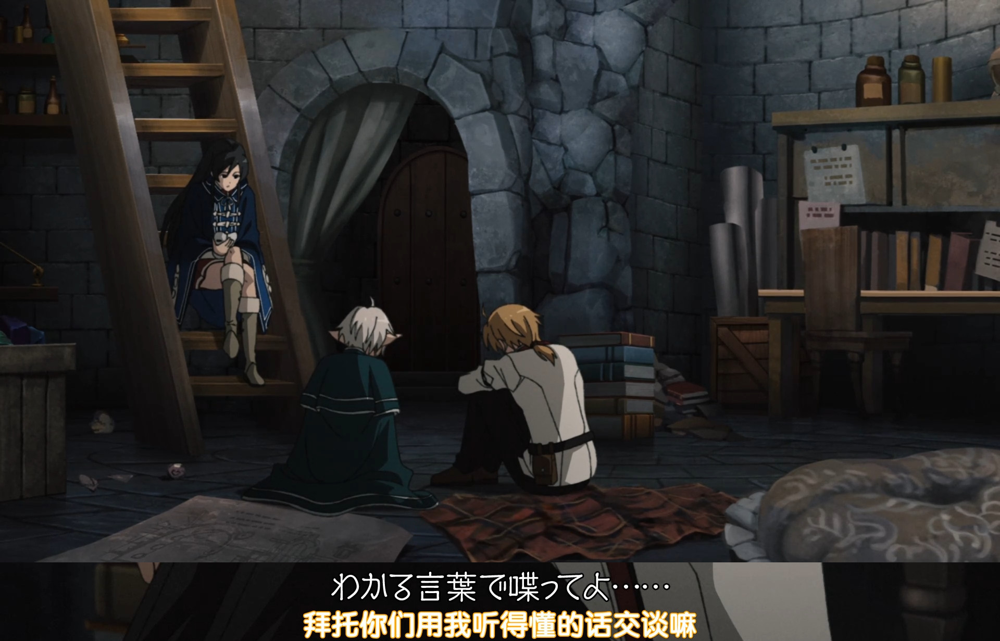
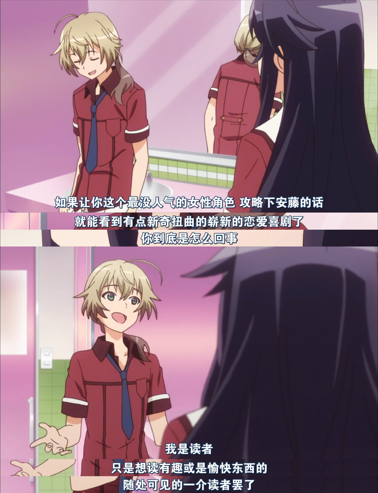
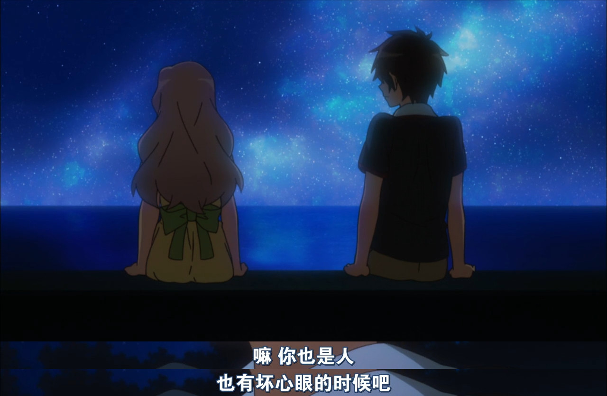

# 你的下一部《MyGO》，何必是《Ave Mujica》

动画推荐：《日常系的异能战斗》

 
图 1 挺好颜。一位角色具有挺王实力，为避免剧透，我没让她登场。

恋爱喜剧。字幕推荐「兔子字幕社」。男主中二病，角色刻画比较丰满，是立派的「亚撒西」。

## 偶遇

我会看这部动画，是因为早见沙织的精彩表演《[连续 2 分 16 秒的宣泄怒吼](https://www.bilibili.com/video/BV1kx411P7E7/)》。 
为什么会想看这个片段呢？这里有段小故事：故事发生在 2024-06-04（所以本文已经拖更 3 个月了），我现在其实已经回忆不起来当时的情况了，这个故事是根据我的浏览器历史记录推测出来的。

这天，我想了解关于《无职转生》的消息，在 B 站搜索，之后被这个视频吸引《[拜托你们用我能听懂的话来说吧](https://www.bilibili.com/video/BV1tu411c7a6/)》（这么「挺」的台词，印象深刻，忍不住反复品鉴）。

 
图 2《无职转生》S02E09-10：16

我以为这句台词是个梗，搜索，遇到了 [AnimeShot 网站](https://as2.bitinn.net/shot/cjdwhonjk008d1s5no77pt3v1)（以后再详谈这个网站）。如此美味😋的表情，激起了我更多的好奇，于是就看了早见沙织那段表演，还做了些[考据](https://t.me/fengwq/90)。

之前我说过，6 月开始我就沉迷在《碧海黑帆》了，所以直到 8 月初才把动画看完。这部动画给了我许多意想不到的乐趣🤣，很开心能遇到它。

 
图 3 S01E09-18：29，读者爱看扭曲的

 
图 4 S01E11-11：37，拟人、通人性

 
图 5 S01E10-05：54，你 MyGO 了吗？

在看《日常系》的时候，我觉得配乐好听，于是定下日程——看完动画后去听 OST（到现在还没听，因为没人上传到网易云音乐，BT 有点麻烦）。然后，在看到第 11 集的 OP 时，突然发现！原来这部动画也是 Elements Garden 配乐的！从《白色相簿》《MyGO》到《日常系》，我记住你们了！

## 相关资源

**VCB-Studio**：于 2023-12-13「旧作重发」[[Reseed Fin](https://dmhy.org/topics/view/658334_VCB-Studio_Inou_Battle_within_Everyday_Life_10-bit_1080p_HEVC_BDRip_Reseed_Fin.html)]，提升至 1080P，画质应该是最高的；而且包含了 BD 限定内容，所以下载了。不含字幕。但是很遗憾，在这个合集中并不包含 BGM，有歌（OP、ED、角色曲）、评论音轨、广播剧。

**兔子字幕社 [TUZI]**：我在线观看的是这版。硬字幕，外挂的字幕只包含注释，所以不是每集都有。OP、ED 歌词特效，还做了人物表情包放在字幕里，有原作党参与翻译。但是 BT 下不动（[合集](https://dmhy.org/topics/view/378339_Inou_Battle_wa_Nichijou-kei_no_Naka_de_01-12_720P_GB_MP4.html)、单集都不行），天使动漫的 [在线站](https://www.dmmiku.com/index.php/vod/play/id/476/sid/1/nid/1.html) 可看。

**优酷土豆（Youku Tudou Anime Sub Team）**：[B站番剧区官号](https://www.bilibili.com/video/BV1kx411P7ME/) 可看，缺第 1 集，但是有兔子字幕社的 [第 1 集上](https://www.bilibili.com/video/BV1Wt411y7ya/)、[第 1 集下](https://www.bilibili.com/video/BV1Wt411y7Yj/)。

**黑川実業字幕組 [K-sub]**：[合集](https://dmhy.org/topics/view/379531_10_01-12_720P_MKV.html)，软字幕，内封。提供了 NicoNico 生放送 3 回（无字幕）。难得 BT 能下完。

**异域字幕组**：把「ネット」翻译成「谷歌」，是不合适的。BT 下不动。

## 早见沙织名场面考据

### 关于台词文本
「萌娘百科」与「NICO NICO 百科」都收录了这段激情怒吼，如果逐字对比日文，可以发现有多处不一样的地方。比如下面这句，对比原声与 Google Translate 朗读，应该是萌娘百科写错了，至少译文凭空译出一个「谷歌」肯定不对。 
ちょっとネットで調べただけで知った**かぶ**らないでよ（[Niconico](https://dic.nicovideo.jp/a/%E3%82%8F%E3%81%8B%E3%82%93%E3%81%AA%E3%81%84%E3%82%8F%E3%81%8B%E3%82%93%E3%81%AA%E3%81%84%E3%82%8F%E3%81%8B%E3%82%93%E3%81%AA%E3%81%84%E3%82%8F%E3%81%8B%E3%82%93%E3%81%AA%E3%81%84)） 
ちょっとネットで調べただけで知った**頑張**らないでよ（[萌娘百科](https://zh.moegirl.org.cn/%E6%A0%89%E5%B7%9D%E9%B8%A0%E5%AD%90)）

### 录制这段 2 分 16 秒的长台词，一遍过？

[萌娘百科](https://zh.moegirl.org.cn/%E6%97%A9%E8%A7%81%E6%B2%99%E7%BB%87)的说明很详细，但**没标来源**；Niconico 百科也没标出处。
> 本人在无NG的情形下，一次就完成该段台词录音，当录音完成时，录音室的音响监督、声优等工作人员与原作者(当天在场)对她的精彩演出报以热烈掌声与喝采，不过事后早见表示︰当天录音时似乎有什么神迹发生在她身上，录音才得以一气呵成，之后就找不回当初那种感觉了。

在 2014-12-19 播出的「Niconico 生放送 第 3 回」（[Niconico](https://live.nicovideo.jp/watch/lv203027217)、[B 站](https://www.bilibili.com/video/BV1Jx411N7Dm/)、[黑川実業字幕組](https://dmhy.org/topics/view/379531_10_01-12_720P_MKV.html)）中，04:35 开始讲这段故事。早见沙织展示了配音台本，山崎遥（神崎灯代）说录制时一遍过了，早见沙织回应：「奇迹、找不回当初的感觉」。不过并没有提到工作人员的喝彩。

还有一篇日语报道《[TVアニメ『異能バトルは日常系のなかで』スペシャルイベント”黒焰に導かれし者達の宴”の公式レポートが到着！](https://www.lisani.jp/0000008460/)》，文内记录了 2015-02-15 日该动画的特别活动（**日场**）的内容，提到了长台词一遍过。
> 長ゼリフはアフレコでは**一発OK**であったことや、早見自身からは、天叢雲剣などルビを振るのが大変だったなどエピソードが語られた

我进一步又找了几小时，只找到了这个特别活动的**夜场**（被收录于[动画第 6 卷 BD 中](https://inou-anime.com/discography/detail.php?id=1008935)，[B 站](https://www.bilibili.com/video/BV1CY411a7NZ?p=8)可看；在 [Niconico](https://www.nicovideo.jp/watch/sm27345945) 也可以免费看一段。），找不到日场的视频（看描述比夜场有趣）。

## 更新日志

2024-11-18 时隔 5 个月，终于看到了「Niconico 生放送 第 3 回」，于是：更新前两篇，合并为本文。 
2024-09-04 发表[动画推荐部分](https://t.me/fengwq/103) 
2024-06-05 发表[考据部分](https://t.me/fengwq/90)