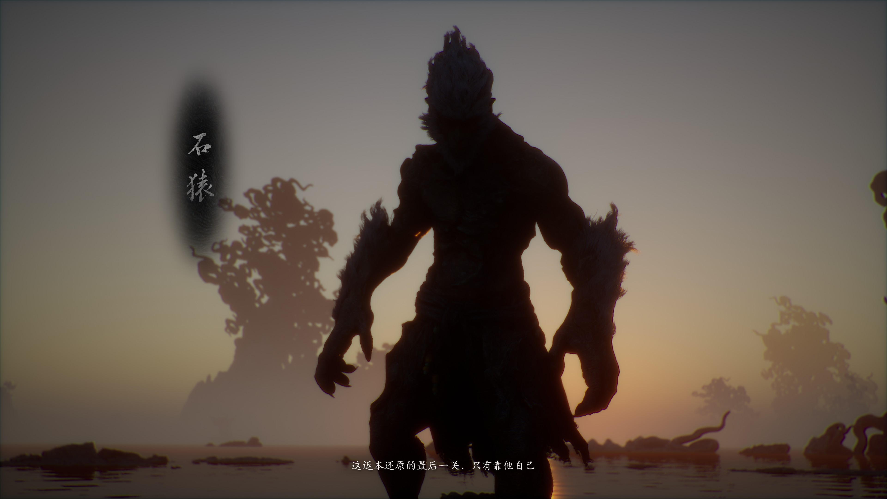
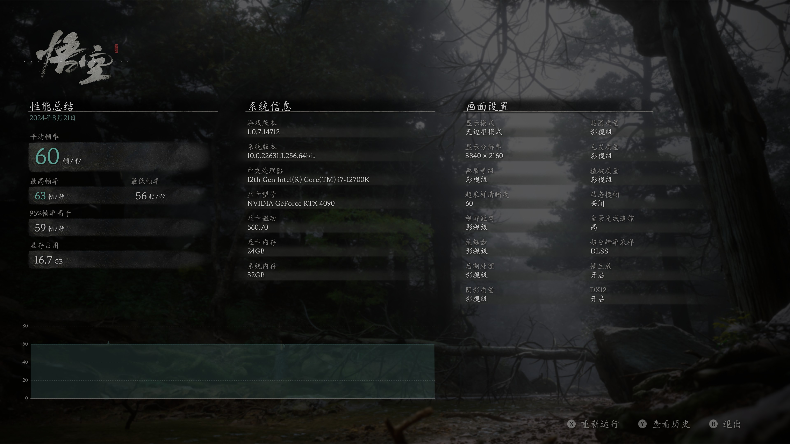
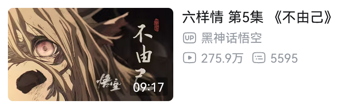

# 《黑神话：悟空》杂谈

## 我与《黑神话：悟空》

《黑神话：悟空》[2020 年第一个预告](https://www.bilibili.com/video/BV1x54y1e7zf/) 就有巨大热度。我作为一个主机游戏玩家，当然也看了。 
但我有意地不去关注它，原因有二： 
仅仅一个预告，离发售还不一定要多少年，结果就热度爆棚。让我想起《赛博朋克 2077》发 [预告](https://www.bilibili.com/video/BV1q4411N7fV/) 后，简中游戏圈狂欢的场面。而在《黑》发预告时，《2077》已经第二次延期，最后发生了载入游戏史的发售灾难；于是《2077》成了我人生中唯一预购的游戏。 
CDPR 起码是做出过《巫师 3》的，玩家猛吹是有依据的；而一个完全没有积累的公司也能被玩家（及非玩家）吹上天，就让我觉得是因为「国产情怀」。但我一向对「国产情怀」保持警惕，热度越高我就越警惕。（仔细一想，《赛博朋克 2077》的预告爆火，也离不开高质量（地道）的中文配音。） 
之后直到《黑》发售，我都没有再关注过它。我既不是期待它成功的「香槟党」，也不是等着它失败「褒娰党」。我玩到游戏序章结束，才知道玩家控制的不是「孙悟空」，而是「天命人」。

我是在 2024-08-21 日买了游戏，两天玩了 20 小时，同时就开始写本文了。所以，本文原先是可能在 2024-09 月发布的，但《碧海黑帆》更需要我。一开始是准备按评测写的，现在已经 11 月了，只好改名叫杂谈。 
我打了一周目全收集通关，等级 111 级（刷钱刷了十几级）；游戏时长 129 小时，其中包括看攻略、相关视频的时间。

**名词约定** 
《黑神话：悟空》简称《黑》。游戏章节标题是「回」目，但我还是更喜欢用「章」节。

## 游戏乐趣

### 画面与美术

如果光影不出问题，挺好看的。只要看看视频就能有直观的体会。我在游玩时曾多次驻足赏景。不仅是场景，物品、部分敌人招式、影神图、每章结尾的过场动画也都有独特的美感。 
不过美景大部分出现在前三章，第四章是虫巢（支线地图好看），第五章是火山，第六章是重复的碧水青山（水帘洞也实在没多少仙气）。 

### 妙趣横生的战斗体验

可以使出耳熟能详的的神通、棍法，有种真的在扮演齐天大圣的感觉。比如定身技能在各种游戏都有，但由猴子使出来就是会有「对味了」的亲切感。这样的战斗体验对于喜爱《西游记》的玩家来说可称得上是圆梦。 
见招拆招的智斗体验。愿意研究打法的玩家，可能会很喜欢。 
但我是菜鸟，想不出打法也不愿意受苦，经常看攻略抄打法。打到后期，多少有些倦怠。

### 影神图（图鉴）

并不是生硬地讲游戏设定，而是讲述一个个的小故事，可以当成「微型小说」阅读。 
故事生动有趣。其中不少都有些「欧·亨利式结尾」的感觉。

### 亲切的文化

抛开「国产情怀」，这种亲切仍然是存在的。我说的亲切并不是「只有中国人才懂」，单纯是「我懂你意思」。 
读者可以自问，哪怕看了一些资料，对其他地区文化的熟悉能达到「西游」的程度吗？可以说，《黑》是一次难得的，在高规格游戏里，没有文化隔阂的体验。

## 游戏问题

**强调一下，虽然游戏问题写了一大堆，但没有特别影响我的体验，玩着还是挺开心的**。 

### 其他玩家反馈的问题

对于不同的玩家，难度、弱引导可能不是问题，但既然可能造成困扰，就写在这部分。 
我是全程看地图、攻略，放弃探索的玩法，所以弱引导、迷路、空气墙这三点没带给我太多的负面体验。

#### 弱引导

没有任务日志。主线、支线全靠玩家理解、记忆、记录。 

#### 迷路

没有地图，场景辨识度低，二者一结合，就很容易让玩家迷路。

#### 空气墙

不确定哪里能走哪里不能走。不确定有没有找完隐藏要素。

#### 关卡与地图设计

这个我不太懂，也不想复述他人观点。

#### PS5 优化差

[【数毛社】PS5版《黑神话：悟空》技术评测 ：视效优秀、但技术问题多多](https://www.bilibili.com/video/BV1GHWSeLEvE/) 
- 性能模式：多数时间能稳定 60，但由于使用了帧生成，输入延迟高。
- 平衡模式：很糊，锁 45 帧（会导致忽快忽慢），输入延迟不错。
- 画质模式：没有锁 30 帧，在 31-36 波动

[黑神话 从来没见过画质这么垃圾的ps5游戏](https://www.bilibili.com/video/BV1UZs4eLEgi/)

### 我体会到的问题

#### 难度

**黑神话悟空没有难度选项**。如果是没有游戏经验的人，建议先试玩一下。如果打不过，一直卡关体验肯定不会好。 
这里也说下我的游戏水平，以供参考：以《战神 4》《战神 5》为例，玩普通难度体验就是「普通」；玩困难难度体验就是「困难」——能打，但是要死很多次；4 代隐藏 Boss 女武神太难，放弃。 
《黑》对于来说就是高难度游戏，我可以记住敌人的部分招式，也能想出一点针对性的打法，部分 Boss 我可以不看攻略，只死几次就打过；但另一部分就只能「逃课」了。我统计了一下，我一共逃了 24 个 Boss，具体可以看我的攻略笔记（如果没人想看就不发了）。

#### 光影

**亮处晃眼，暗处看不见**。如果是不看地图，完全自己探索，这是严重影响体验的问题。 
通常情况下，天命人自带光源，可以照亮周围小范围环境，这样就还行。但这个自带光源经常消失（比如从暗处走到光亮处，再走到下一个暗处），而且重新加载地图也不恢复，以致于我不确定它是不是 Bug。光源消失的后就是两眼一摸黑。 
**过曝 Bug**：也是在明暗切换后出现，导致整个画面异常地亮（发白）。我是在黄风岭-沙门村-村口，从亮处走到这个土地庙触发的。 
**连过场动画的光影都有大问题**。比如「石猿」作为一个 Boss 的登场画面，这么黑，让我看什么？我看了多个主播的流程视频，确认不是我个人问题。

{:height="50%" width="50%"}

#### 卡顿、掉帧

我按照「**推荐设置**」（请注意这点）打完了第一关。不止是打怪，**连跑图时转镜头都会卡顿、掉帧**。以我的配置，能跑 4K 90 帧，但游戏的帧率上限又没有提供 90 帧的选项，于是只好锁定在 60 帧。锁定 60 帧后，画质测试很稳定（如图），但实际游玩时仍然经常出现卡顿、掉帧。 
打到第二章我发现，**不锁帧的体验才更好**，转视角是丝滑的；而锁帧的画面看起来是**一帧一帧地蹦出来**，每帧都在卡。在不锁帧的情况下，也偶尔会在 Boss 出招时感受到掉帧。

{:height="50%" width="50%"}

这里不讨论《黑》的优化算不算好，重要的是，一个动作游戏的性能测试里不测战斗，这个「推荐设置」没有起到它该有的作用。玩家还是需要学习相关知识、手动调整设置才能畅玩。

#### 在 PC 上的 DualSense Edge 手柄适配问题

不是原生支持，需要启用 Steam 输入。 
操作是没问题的，但正如 Steam 提示的那样，「会看见错误的图标」。哪怕是手动设置图标后，下次启动游戏，还是会自动切到 Xbox 的图标。

#### 新手教学

**令人迷惑** 
通常，游戏在教学时，如果玩家没有完成一某个动作，则相关教学说明会一直显示在屏幕上；完成之后，才会显示下一个动作。但《黑》就只是展示一遍键位，导致**玩家无法确认自己是否完成了该动作**。比如我在序章中就只学了锁定、轻攻击、翻滚。我都不确定是只教学这三个动作，还是我没有做好这个动作，一直没办法学下一个。就像那些不管学生有没有听懂，反正就硬念 PPT 的老师。 
最贴心的教学会以动画演示该动作是什么样的（《黑》里的技能也有演示，但教学没有演示），以便玩家确认自己的操作是否正确。

**不够完善** 
完善的新手教学，是会把所有的基本操作都教一遍的。一般是从移动视角开始教学，顺带确认是否反转视角。而《黑》的新手教学缺少视角、移动、轻击连段、释放技能。

#### 过场动画存在生硬的切换

生硬一是体现在镜头上无法衔接。二是明显的「加载」的感觉——从一个视频切换到另一个。 
在序章中，这个问题出现了 2 次（二郎神最后打孙悟空那一下很明显）。

#### 加载速度慢

我硬盘是 980 Pro。 
即使是我是看攻略玩，大大减少跑图的情况下，也都有点不耐烦了。 
而且加载过程中，**加载界面的小提示不能切换上一条与下一条**，加载完成了才能切换。这是非常低级的错误。

#### 叙事不完整（剧透警告）

**剧情靠自己脑补，付费替编剧干活**。吾不为也。

游戏剧情是基于《西游记》原作的二创。如果玩家不熟悉《西游记》，只靠过场动画与台词是无法理解剧情的。看完 86 版《西游记》电视剧及续集，并且还记得情节；了解过电视剧与原作的区别，就可以算得上「熟悉」了。 
游戏二创的设定，主要是靠影神图讲述，但人物动机、前因后果都没讲清楚，严重缺乏信息量。而且《黑》并非续写《西游记》，而是直接改了原作的部分剧情。结果就是很多没讲清楚的部分连推测的依据都没有，只能建立在另一个推测上。 
大部分支线的叙事比较完整，主线反而无头无尾。**无头**：大圣辞去佛位是看不惯神仙为了「长生」而做的恶事，恶事是什么，没讲。**无尾**：结局一戴上金箍就结束了，之后天命人如何，不讲。结局二找回了大圣的记忆，就结束了。难道剧情的核心是复活大圣吗？这是个医疗剧？

**每章结尾的动画无法完成叙事任务** 
引用 [Leya蕾雅](https://www.bilibili.com/video/BV1MD42ezEM6/) 的话「既想用电影化演出去感染玩家，又想要碎片化藏剧情去引发讨论，结果两者叠加并没有获得加成，反倒效果相克了。」 
1、6 基本是西游原作故事，2、3、4 跟大圣几乎没关系，5 讲了点主线，但主角是牛魔王。在看第 5 话的时候，我还想终于讲主线了，第 6 话应该会把整个事情讲清楚吧，结果回忆了一遍西游。动画一共没几分钟，还浪费资源不讲主线。

**四妺的故事莫名其妙** 
四妺的一见钟情没有铺垫，非常突兀。要不是看到网友评论，我真感受不出来四妺喜欢天命人。凭什么就喜欢上了？哪怕应付一句「亚撒西」我都当你交代过了。 
而且，**游戏全程都几乎没有描写过天命人的想法**，天命人既哑巴又面瘫，在四妺的这段剧情里也不例外。在其他故事里，天命人不说话问题不大，反正就是干；到了爱情故事里，还是没有互动，更没有「干」，这就是叙事失败。总不会是借鉴 galgame 吧，男主不说话方便玩家代入？

## 剧情吐槽（剧透警告）

动画《六样情》每集质量都很高，很好看。但有些地方细想一下，剧情就站不住脚。

### 第 2 话《聋》

**书生「行善」是恶，「作恶」非恶** 
「善恶一念间」这个主旨的前提是「人妖平等」，至少也是「妖能修炼成人形，有了人权」，否则是不成立的。在「灵狐」的影神图里明确了，此时它还不具有化形的能力。男主是书生，不是僧，看起来也不信佛；更没有法力，看不出狐狸在修仙。综上，灵狐对书生来说只是动物。 
灵狐踩中了猎户的陷阱，是猎物，是猎户的财产。因此，书生救下灵狐是盗窃。 
除去盗窃罪之外，杀一只动物，不算作恶。（就算你能证明剧中存在动物保护法，我支持的也是自然法。） 
现实世界里没有妖，讨论人、妖是否平等没有意义；但有动物保护，有人禁止别人吃狗肉。 

### 第 4 话《勿听》

「**撞见私会**」 
如果不参考原作，看不懂剧情；如果参考，那嫦娥边上那男的是谁？天篷元帅没有出格的行为，嫦娥也没有明确的拒绝，凭什么就贬下界了？ 
广泛流传的说法是撞见天龙人私会，被灭口，合理。但这完全是脑补，因为在纪录片《[路在脚下：对话杨奇：<黑神话：悟空>的美术之路](https://www.bilibili.com/video/BV1v5tQeYEUq/)》中，17:36 制作人杨奇表示不知道那男的是谁。制作人都不知道「八折星君」是哪个屌毛，还有什么猜测、考据的必要吗？八折星君是合作伙伴的要求，显然它与游戏本身的叙事产生了冲突。

「**把高翠兰错认为紫蛛儿**」 
这也是部分观众以「美好爱情故事」为目标，自己脑补出来的。八戒下界后，人形的容貌是不变的，所以第三个登场的女性不能推测为紫蛛儿投胎。说实话，我第一次看动画的时候，都没反应过来她可能是高翠兰（较真的话，她很可能不是高翠兰，因为高家跟**染坊**没什么关系），只是想到八戒见一个爱一个。此时八戒跟紫蛛儿又不熟，怎么可能把她错认成紫蛛儿？假设八戒真的错认了，动画加两秒，做个紫蛛儿的人脸虚化叠在高翠兰脸上，成本很高吗？

**八戒偷看蛛蜘精洗澡** 
显然是在认出紫蛛儿之前，就变鱼住水里钻了，这美好吗？这得打入地狱吧！

**八戒对紫蛛儿还有感情吗？** 
口是心非？在百眼魔君的过场动画里，紫蛛儿连人形都维持不了，语气虚弱，显然伤得不轻。之前紫蛛儿 Boss 战的时候，八戒台词可不少，但有一句是让天命人手下留情的话吗？拼死厮杀的时候，还要口是心非？

**紫蛛儿对八戒的感情** 
只要不细想，还是很感动的。 
第四章开篇的过场动画，送礼的小妖说「那妖婆有些个怪癖，八节四时都要进补，每次进补必要成亲」，可知紫蛛儿每年要多次成亲。这么多成亲的对象，没一个在剧情中出现，像是消失了。 
在「八戒成亲」的过场动画中： 
二姐：「（八戒）不过是母亲**修练用的精元**。……她**数十年**的病根一直好不了，正是拜这蠢物所赐」。在序章「老猴子」对天命人讲故事的过场动画中，说的是「这便是大圣六根的传说。可惜数百年来，无人亲眼得见」。假如「数十年」是从取经算起，那就与「数百年」有**时间线矛盾**。 
大姐：「你我当时**都未出生**，不曾见母亲用过的情」。 
在「一打八戒」的过场动画中：八戒：「什么东西？**一夜风流**而已，竟要老猪的命来偿」 
结合二姐与八戒的话，再联系现实，部分种类的蜘蛛交配后，雌性会吃掉雄性（[维基百科](https://en.wikipedia.org/wiki/Spider)）（学名「[性食同类](https://en.wikipedia.org/wiki/Sexual_cannibalism)」）；可以推测那些成亲对象是被吃了。**成亲可能是绑架的幌子，也可能真的交配了**（双修也是修炼）。

**六妺的五位姐姐的父母是谁？** 
不少人信誓旦旦地说她们是紫蛛儿姐妺的孩子。请问证据在哪？有暗示也行啊。我已经看过了几个不讲逻辑，脑补剧情的帖子（比如这个 [强行综上](https://ngabbs.com/read.php?tid=41524443)），如果本文评论中也有，就当我提前回复你了。 
她们五个不是八戒的孩子，这是有依据的：1.在「紫蛛儿捆绑八戒」的过场动画中，紫蛛儿说「吃不下去……不单是为你，更是为她」；是「她」，不是「她们」。2.在六妺的影神图中，猪妖说「你爹也是头猪」是个「大家都知道，唯独不让你知道的秘密」。

紫蛛儿与八戒的两段快切画面，冲击力确实强，即使是想了这么多杂念的我，也差点泪目。

几分钟的动画，八戒找了 3 个对象，这种爱情故事真的很难说是「美好」，更像是见一个爱一个，最后终于有人要了的「凑合过吧」。紫蛛儿算是痴情，八戒像花心、露水、留情。八戒再怎么口是心非，他最后选的也是取经。 
故事要是讲清楚了，还会有质疑的空间吗？这么多「留白」的结果是剧情千疮百孔，而不是什么艺术性。

### 第 5 话《不由己》

请看图，由于我看过几百个《MyGO》的二创，在我注意到 UP 的名字之前，我一直是这样想的：一看封面，是初华；二看标题《六样情》，样「祥」子。原来是初华与祥子的二创，看起来还是个苦情戏。百万播放！必看！

{:height="50%" width="50%"}

## 游戏之外

写到这里已经几千字了，黑神话团队的采访、幕后故事之类的，我是真不想看了。我怕我忍不住浪费时间，写到上万字。

### 消费者没有义务同情商家

尽管游戏被称为「第九艺术」，但它仍然是一个拿出来卖钱的商品，甚至是工业品。玩家（消费者）需要关注的只有游戏质量，一手交钱一手交货就足够了。 
什么「公司仅有 140 余人」「团队缺乏经验」都是跟游戏质量无关的同情分。

### 文化输出跟你有鸡巴关系

张三和李四是同学，两人没说过话。李四在国际比赛中获奖。老师高兴，因为有奖金；校领导高兴，因为可以拿来做招生宣传；张三也高兴，因为有「高尚的」**集体荣誉感**。 
 
游戏质量高，开发者们当然可以「自豪」。但一个普通玩家有这样的情感就很奇怪。 
如果中国消费者对非国产商品产生「自豪感」，一般被称为「精神股东」（通常是贩义），更难听的是「* * 批 / 豚 / 狗 / 蛆」。而对于国产商品，尤其是（可能）实现弯道超车的商品，就能够从消费者的期待中感受到强烈的「民族自豪感」。如果不是长年在教育时灌输集体主义，人是不会产生这种「利益一致」的错觉的。

按国籍（政权）给文化、艺术分类，体现的就是国家主义思维。只有政府控制的项目，才有可能构成「文化输出」「文化入侵」。《黑》的投资方里没有政府，只有「万恶的资本」。我所接触的多数文娱产品也都是在资本支持下才诞生的，它们不服务于政治目标，只是想赚钱而已。如果抱着文化输出的目标去创作，那最后只会得到宣传政治正确的「样板戏」，称不上艺术作品。

### 有没有破坏传统文化？

这个是关于游戏剧情的最大争议了，战况也最激烈。「破坏中国传统文化」是 [弓手冬郎](https://space.bilibili.com/35857776) 说的。[芒果冰OL](https://space.bilibili.com/617285) 发了个 [视频](https://www.bilibili.com/video/BV1wz421q7bx/) 反驳，入选 B 站每周必看。 
但我根不屑于讨论这个问题。因为真正的问题是：**如果某个事物在中国被定义为「破坏传统文化」，那它就没有生存空间了**。 

> 我对国学的看法是：这种东西实在厉害。最可怕之处就在那个“国”字。顶着这个字，谁还敢有不同意见？这种套子套上脖子，想把它再扯下来是枉然的；否则也不至于套了好几千年。它的诱人之处也在这个“国” 字，抢到这个制高点，就可以压制一切不同意见；所以它对一切想在思想领域里巧取豪夺的不良分子都有莫大的诱惑力。 
> ——王小波《沉默的大多数》

美国的政治正确近年来在游中的影响越来越大，破坏了游戏质量。我看到很多玩家嘲讽这种现象。我不知道他们有没有比较过中国的政治正确，那可都是定生死的。