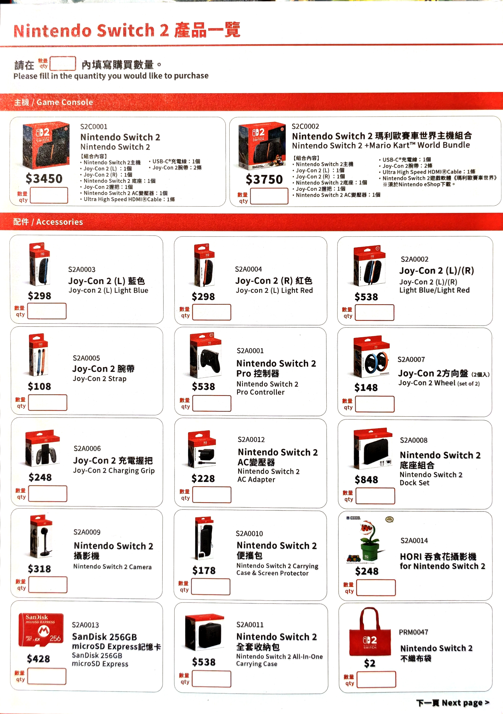
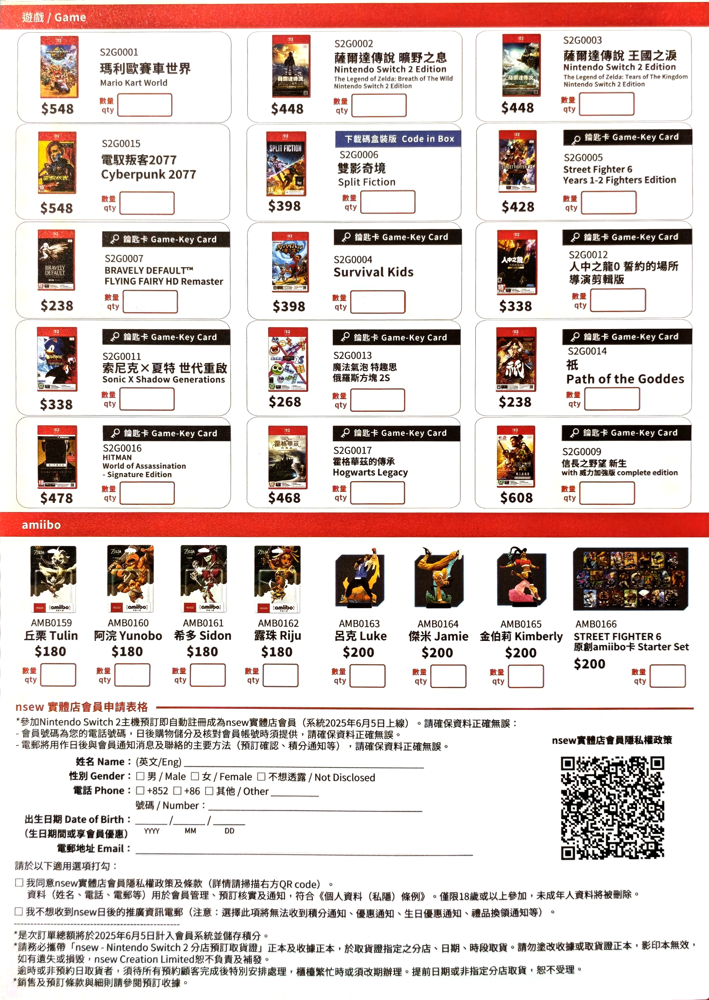
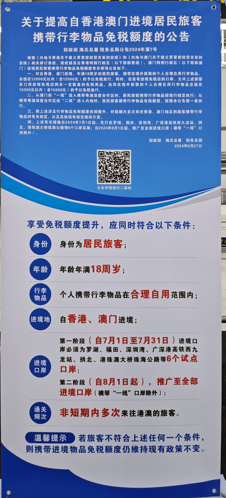

# 去香港买 Switch2 全流程攻略

## 比网购便宜吗？

**如果你是专门为了买 NS2 而去香港，值得吗？省钱吗？** 请看下表：

| 事项                             | 花费                     |
| -------------------------------- | ------------------------ |
| 港澳通行证                       | 60 CNY                   |
| 签注                             | 15 CNY                |
| 境外上网流量                   | 10 CNY 起                |
| 到达香港口岸交通费               | 因人而异                 |
| 到达 NS2 商店交通费（估算）      | 巴士 15 CNY；高铁 68 CNY |
| NS2 单机版                       | 3450 HKD（3155 CNY）     |
| NS2 同捆版                       | 3750 HKD（3428 CNY）     |
| 招行信用卡 -100 券               | -100 CNY                 |
| 返程交通费                       | 巴士 15 CNY；高铁 68 CNY |
| **单机到手价**                       | **3170 CNY 起**     |
| **单机到手价（不计算通行证、签注）** | **3095 CNY 起**         |

价格是一方面，买行货意味着有官方保修。

## 选择哪个商店？

### nsew 

因为我也是在小红书上看到了 @[tinypuppet](https://www.xiaohongshu.com/explore/684fa0fc00000000120038f3) 和 @[🌈来日方长🌈](https://www.xiaohongshu.com/explore/6854edd40000000012017cd6) 写的攻略，所以是直奔 nsew (K11 MUSEA 分店)去了。  
nsew 店的政策变化挺快的。6 月上旬可以刷银联卡，后来说手续费高，不给刷了。6 月 24 日又通知现货必须要搭配游戏、配件才能买。  
nsew 有 3 家店，他们在小红书有号 @[nsew Staff](https://www.xiaohongshu.com/user/profile/658639a7000000001c03da26) 会通知是否缺货。

### 深水埗（bù）黄金电脑商场

这里部分商家比官方价还便宜一两百，但刷信用卡、支付宝、微信都有手续费，有的也需要捆绑购买才是低价；不同店家手续费不同，大约是 1.5% ~ 4% 。现金没有手续费。  
在 Google Play 搜索「Price香港」下载 App，可以查询商家报价，建议确认有货后再去购买。想省钱的话需要花多问问。
因为 NS2 现在发售还不到一个月，估计也不会有翻新，最多也就只是二手有人摸过的。

## 购买全流程

**下面是我去 nsew (K11 MUSEA 分店) 的购买全流程，供参考：**

**记得带充电宝、USB-A 充电线，或者有转换器的充电头**

**办理「港澳通行证」**

**办理香港签注**  
微信公众号「深圳公安」- 警民互动 - 便民互动 - 警务电子地图 - 出入境智能签注点。智能签注点是 24 小时服务的。

**开通「国际漫游」**  
不开通无法收发短信。**记得在境内开通**，因为自己办理有 2 种方式：1.发短信开通。2.登录网上营业厅开通，登录需要接收短信验证码。这 2 种在境外都做不到。

**境外上网**  
支付宝「境外上网」流量包 10 元 1 天 3 GB。这个价格是中国移动的，网络质量只是及格水平。  
也可以到香港后买实体卡。

**到达 nsew 商店**  
深圳湾口岸早上 9 点左右很堵，我堵了 10 分钟。所以打车建议到「人才公园」地铁站，再坐一站地铁。  
顺着指引出境后，往左边走坐巴士。  
微信搜索「搭车码（搭車碼）」小程序，可以刷二维码乘坐香港公交、地铁。  
**B3X** 换乘 **50** 到尖沙咀（zuǐ）（注意别坐错车了，B3M 没有换乘优惠，会多花 15）  
尖沙咀具体是在「**中間道**」公交站下车。可以下载「hkbus」App 查询公交信息（有网站服务，但手机浏览器定位不一定能用）。  
巴士从上车到下车用时：1 小时 20 分钟  
下车后步行到店，10 分钟  
nsew (K11 MUSEA 分店) 在 B2 层  
排队、填写购物纸到拿货 10 分钟。购物纸要填写英文名、手机号（图 1、图 3）。  

{:height="50%" width="50%"}

{:height="50%" width="50%"}

{:height="50%" width="50%"}

**付款**  
招行 VISA 信用卡。可在「掌上生活」App 搜索「境外」，点「非常境外游」领取满 3000 减 100 CNY 的券。  
NS2 单机版  3450 HKD（3155 CNY）（图 2）  
Pro2 手柄  538 HKD（492 CNY）  
凭小票保修一年。  

**返程**  
我绕道去买了其他东西，返程的时候被 * 度地图的路线规划坑死了，体感抱着两大件共 7kg 走了 3km 冤枉路。  
但是 Google Map 感觉也不太好用。  

**入境清关**  
15 天内没有去过香港，就有 12000 CNY 的免税额度。（图 4）  
一个人带两台肯定会被拦下检查。至于能否让海关工作人员认同是合理自用，就不好说了。  
检查出入境记录用的是微信 12367 移民局小程序，第一次使用需要注册。（为什么海关系统不能查？全国数据不互通吗？）  

{:height="50%" width="50%"}

## 更新日志

2025-06-26 第一版  